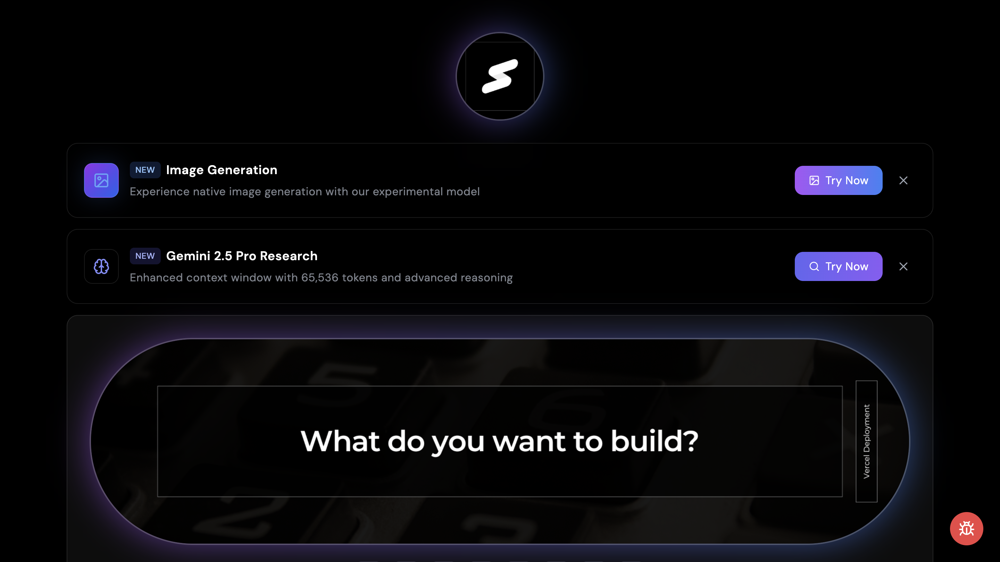

# 🎯 Keynote Platform

A next-generation presentation and learning platform powered by Google Gemini AI, featuring enhanced visual aesthetics and modern UI elements.

[](https://keynote-niladridas.vercel.app/)
[](https://www.typescriptlang.org/)
[](https://reactjs.org/)
[](LICENSE)



## ✨ What's New

### Visual Enhancements (Latest Update)
- **Enhanced AI Image Generation**: Improved prompts for more sophisticated visual outputs
- **Modern UI Elements**: Added dynamic gradients and smooth animations
- **Responsive Design Updates**: Optimized layout for all screen sizes
- **Interactive Elements**: New hover effects and transitions

```typescript
// New AI Image Generation Implementation
public async generateHeroImage(): Promise<string> {
  const prompt = `Create a hyper-modern, minimalist representation of AI and machine learning. 
    Use a sophisticated dark theme with:
    - Subtle neon accents in electric blue and deep purple
    - Floating geometric particles
    - Abstract neural pathways with gradient illumination
    - Clean, sharp edges and modern design elements`;
  
  return this.generateImage(prompt);
}
```

## 🚀 Overview

Keynote Platform combines cutting-edge presentation capabilities with AI-powered learning features. It leverages Google's latest AI models to create an immersive educational experience.

### 🤖 AI Integration

- **Gemini 2.5 Pro** (`gemini-2.5-pro-exp-03-25`) - Advanced text generation
- **Gemini 2.0 Flash** (`gemini-2.0-flash-exp-image-generation`) - AI image creation

## 💡 Core Features

| Feature | Description |
|---------|------------|
| 🎨 AI-Powered Content | Dynamic content generation using Gemini 2.5 Pro |
| 🖼️ Image Generation | Enhanced AI image creation with modern aesthetics |
| 🔄 Interactive Interface | Seamless presentation experience with new animations |
| 📚 Research Tools | AI-assisted research capabilities |
| 📱 Responsive Design | Optimized for all devices with new UI improvements |
| ➗ Math Support | KaTeX integration for mathematical formulas |

## 🛠️ Tech Stack

### Frontend
```json
{
  "core": {
    "framework": "React 18.3",
    "language": "TypeScript 5.5",
    "styling": "Tailwind CSS",
    "animations": "Framer Motion"
  },
  "ai": {
    "provider": "Google Gemini AI",
    "models": ["gemini-2.5-pro", "gemini-2.0-flash"]
  }
}
```

### Key Libraries
- KaTeX (Mathematical notation)
- React Markdown (Content rendering)
- React Syntax Highlighter (Code examples)

## 🚦 Getting Started

1. **Clone the repository**
```bash
git clone https://github.com/bniladridas/keynote-niladridas.git
cd keynote-niladridas
```

2. **Install dependencies**
```bash
npm install
```

3. **Configure environment**
```bash
cp .env.example .env
# Add your Google Gemini AI API key to .env
```

4. **Start development**
```bash
npm run dev
```

## 📂 Project Structure

```
src/
├── components/     # UI components with new visual elements
├── lib/           # Core utilities & enhanced AI integration
├── hooks/         # React hooks
├── styles/        # Updated global styles
└── types/         # TypeScript definitions
```

## 🤝 Contributing

We welcome contributions! See our [Contributing Guide](CONTRIBUTING.md) for details.

### Quick Start for Contributors
```bash
# Fork and clone
git clone https://github.com/YOUR_USERNAME/keynote-niladridas.git

# Create feature branch
git checkout -b feature/amazing-feature

# Commit changes
git commit -m "feat: add amazing feature"

# Push and create PR
git push origin feature/amazing-feature
```

## 👤 Author

**Niladri Das**
- 🌐 [GitHub](https://github.com/bniladridas)
- 🐦 [Twitter](https://twitter.com/bniladridas)
- 💼 [LinkedIn](https://linkedin.com/in/bniladridas)

## 📄 License

MIT License - See [LICENSE](LICENSE) for details.

---

<p align="center">Made with ❤️ by Niladri Das</p>
